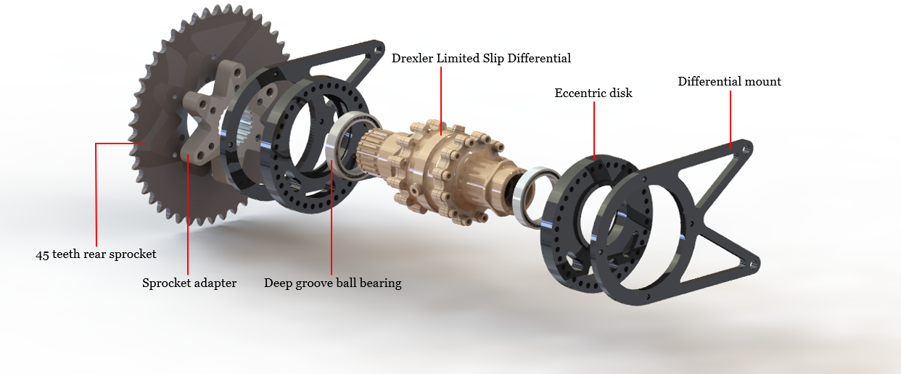
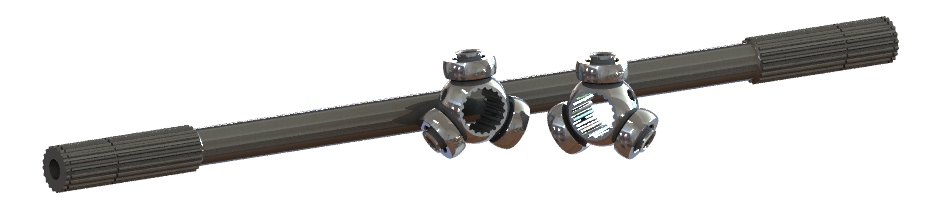

<h1 align="center">Internal combustion engine racing car</h1>

**Team:** TeamKART Motorsports

**University:** IIT Kharagpur

**Location:** Kharagpur, India

**Duration:** Apr 2017 - Apr 2020

**Role:** Powertrain Team Head

---

***Project objective:*** *Design and development of transmission systems for ICE Formula Student racing car*

**My contributions:**
* Spearheaded the powertrain team in the designing and manufacturing phase of the FSAE ICE vehicle K4
* Led the drivetrain team in the preparation and presentation of the design report for the Design Event of Formula Bharat 2019
* Designed an eccentric-disk chain tensioning mechanism as an improvement over the previous turnbuckle mechanism to tighten the
sprocket-chain drive of K4
* Performed FEA of differential mounts and eccentric disks achieving a weight reduction of ~1.2 kg
* Analyzed and selected deep groove ball bearings for interference-fitting application in the eccentric disks
* Ran simulations in Optimum Lap for parametric optimization of the final drive ratio based on the comprehensive vehicle data

<em>Figure 1: Transmission system.</em>

  

<em>Figure 2: CV joint tripods.</em>

